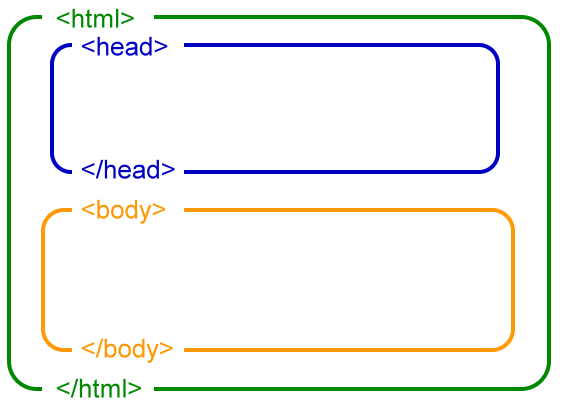
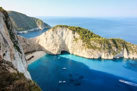
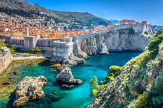
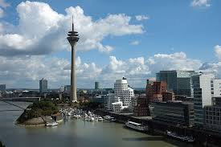

1. Initirea unui fiser HTML:
   <!DOCTYPE html>
2. Structura unui fiser HTML:
   

3. Partea vizibila/invizibila [head/body]
4. Crearea unui Liste:
   <ul> - Unordered List
   Tag-ul <ul> este folosit pentru a defini o listă neordonată, adică o listă în care ordinea elementelor nu este importantă. Elementele dintr-o listă neordonată sunt de obicei marcate cu bullet points (puncte).

   <li> - List Item
   Tag-ul <li> este folosit pentru a defini un element dintr-o listă, fie ea neordonată (<ul>) sau ordonată (<ol>).
5. Crearea unui tabel:
   <table border="1">: Creează un tabel și setează o bordură pentru acesta.
   <tr>: Definește un rând în tabel. Fiecare rând din tabel este plasat între tag-urile <tr>...</tr>.
   <th>: Definește o celulă de antet (header) în tabel. Antetele sunt de obicei afișate cu text îngroșat și aliniat la centru.
   <td>: Definește o celulă de date în tabel. Fiecare celulă de date este plasată între tag-urile <td>...</td>.

   <!DOCTYPE html>
   <html>
   <head>
       <title>Exemplu Tabel HTML</title>
   </head>
   <body>

   <h2>Exemplu de Tabel</h2>

   <table border="1">
     <table border="2">
         <tr>
             <td>Ţara vizitată</td>
             <td>Anul</td>
             <td>Imagine</td>
             <td>Descriere</td>
         </tr>
         <tr>
             <td>2016</td>
             <td>Grecia, Atena</td>
             <td></td>
             <td>O călătorie în Grecia este o experiență fascinantă, unde istoria antică se întâlnește cu frumusețea naturală. Vizitarea Parthenonului din Atena oferă o privire asupra măreției civilizației grecești. Insulele grecești, precum Santorini și Mykonos, încântă cu plaje superbe și ape cristaline. Gastronomia locală impresionează cu mâncăruri delicioase precum gyros, moussaka și tzatziki. O plimbare prin satele pitorești cu străzi înguste și case albe creează o atmosferă idilică. Grecia este locul ideal pentru a te relaxa la soare, a explora situri arheologice și a savura ospitalitatea locală.</td>
         </tr>

         <tr>
             <td>2018</td>
             <td>Croatia, Split</td>
             <td></td>
             <td>O călătorie în Croația este o aventură captivantă, unde peisajele naturale spectaculoase se îmbină cu istoria bogată. Orașele medievale Dubrovnik și Split impresionează cu arhitectura lor bine conservată și străzile pavate. Parcul Național Plitvice, cu lacurile sale cristaline și cascadele uimitoare, oferă o experiență de neuitat în mijlocul naturii. Coasta Adriatică este perfectă pentru iubitorii de plajă, iar insulele croate, precum Hvar și Brac, sunt renumite pentru apele lor limpezi și viața de noapte vibrantă. Gastronomia locală, cu influențe mediteraneene, completează perfect această destinație fermecătoare.</td>
         </tr>

         <tr>
             <td>2019</td>
             <td>Germania, Düsseldorf</td>
             <td></td>
             <td>O călătorie în Düsseldorf, Germania, oferă o combinație perfectă de cultură, istorie și modernitate. Orașul este cunoscut pentru Altstadt, centrul vechi, cu străzi pietruite și numeroase berării tradiționale, unde poți savura faimoasa bere Altbier. Promenada de pe malul Rinului este ideală pentru plimbări relaxante și priveliști superbe. Königsallee, bulevardul de lux, încântă cu magazine de designer și buticuri elegante. Orașul găzduiește și numeroase muzee și galerii, inclusiv Kunstsammlung NRW, cu opere de artă modernă și contemporană. Festivalurile și evenimentele anuale, cum ar fi Carnavalul din Düsseldorf, adaugă o notă vibrantă acestei destinații fascinante.</td>

         </tr>
     </table>
   </table>

   </body>
   </html>
